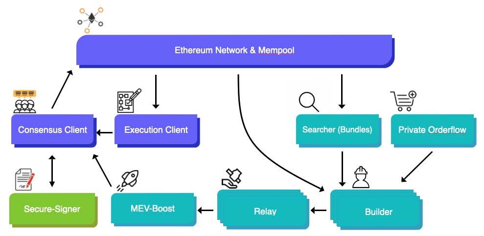

To mitigate the effects of economies of scale, [Proposer-Builder Separation (PBS)](https://ethresear.ch/t/proposer-block-builder-separation-friendly-fee-market-designs/9725/6) was proposed
and implementations like [MEV-Boost](https://github.com/flashbots/mev-boost) were built to help democratize access to MEV opportunities
to all validators. MEV-Boost is a middleware software that interacts with consensus clients, exposing
validators to a marketplace of MEV-optimized blocks. Builders bid to have their blocks proposed by
validators in exchange for the block rewards. By decoupling block building from proposing, validators
are no longer required to specialize in MEV extraction to remain competitive, lowering the barrier
of entry and promoting decentralization. For example, efficient MEV extraction requires compute
requirements beyond what is expected for validators, barring entry for many solo validators.

Block builders benefit from economies of scale and are prone to cartelization, but do not pose the same threat
to Ethereum since validators ultimately control the blockspace.

Secure-Signer is compatible with MEV-Boost. The NoOp’s consensus client transfers block headers
from the MEV-Boost middleware to Secure-Signer, which will only sign it if the header’s slot is
strictly greater than the last slot signed by Secure-Signer. This combination empowers any NoOp with
slash-resistance and access to MEV-competitive blocks. The Puffer Pool further increases financial opportunities
by exposing the NoOp to the pufETH LSD and leveraged staking.

